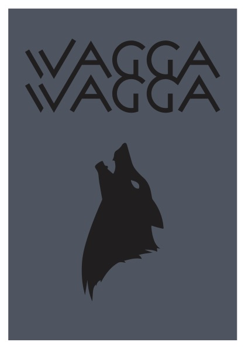

# Introduction

With a brief introduction of our lecturer Adrian and an icebreaker for the class; our name, media currently enjoyed, creative and non-creative outlet, and finally the most recent rural town visited, we learnt a little about our peers in our hybrid studio. 

I'll start with me.
1. My name is Bridgette, preferred name: Bridie 
2. I've recently been reliving the great *Seinfeld*
3. Stretching my creative muscles with a second hand Nikon 3500
4. Stretching my (non) physical muscles with a boulding membership 
5. And I annouced Wagga Wagga as my most recent rural visit. 

After this round-robin icebreaker we touched on the assesments for this studio (more on that later) and kicked off into our first studio exercise: A postcard of that recent rural vist. 

